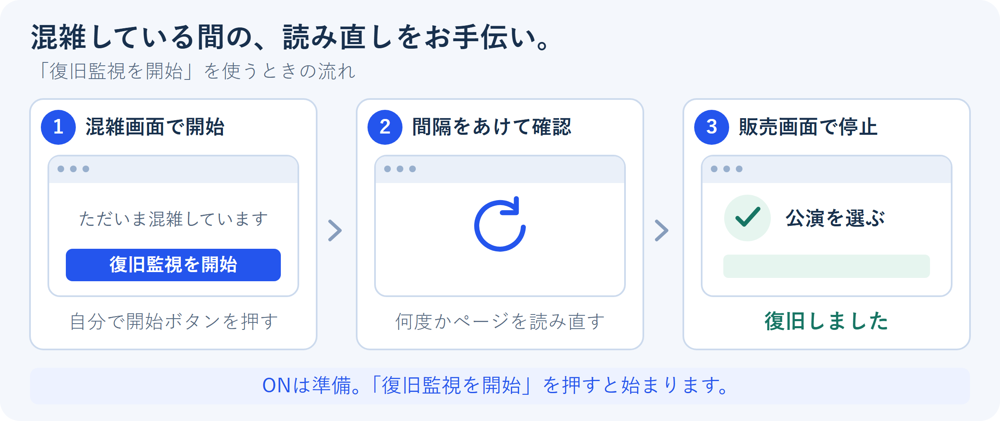
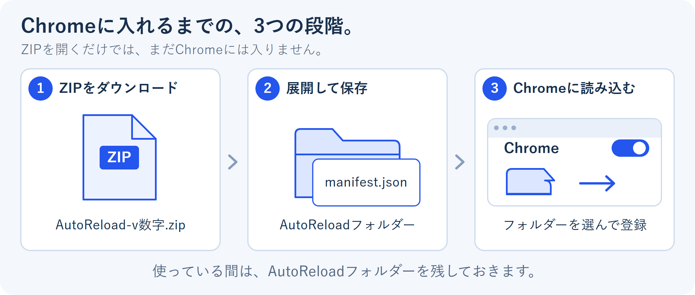
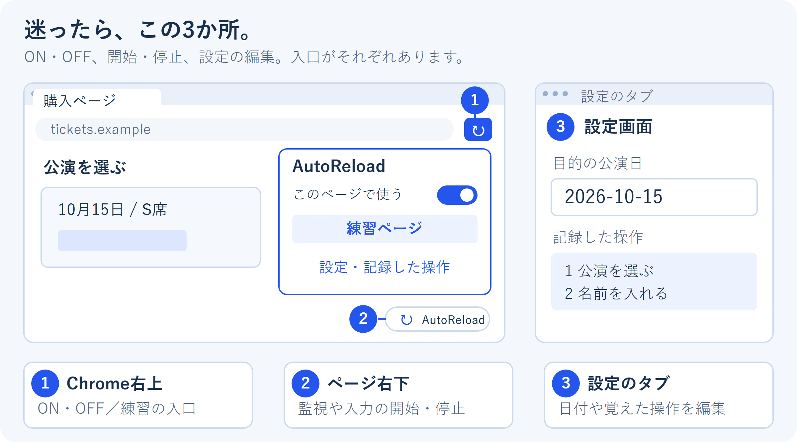
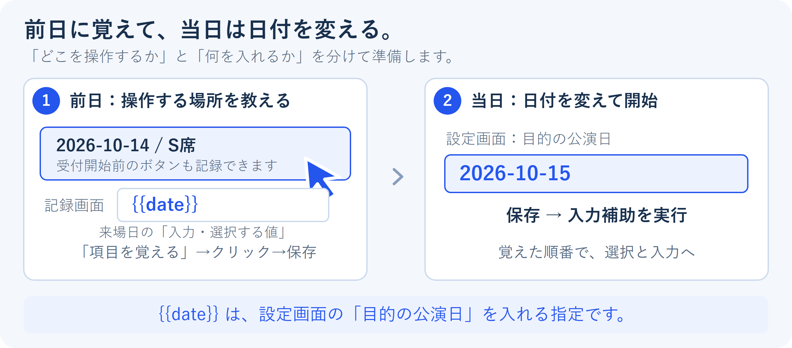

# AutoReload — チケット購入のお手伝い

**「ただいま混み合っています」の画面から販売ページに戻るのを待ったり、あらかじめ覚えさせた欄に名前や日付を入れたりする、パソコン版Chrome用の道具です。**

Chromeに機能を追加する「拡張機能」として使います。入れた後は、Chromeの右上にあるAutoReloadのアイコンから操作できます。プログラミングの知識は必要ありません。

**[ダウンロードページを開く](https://github.com/check5004/AutoReload/releases/latest)** · [入れ方から読む](#1-chromeに入れる) · [まず練習する](#3-購入のない練習ページで試す)

## 何を手伝ってくれるの？

| こんなとき | できること | 押すボタン |
| --- | --- | --- |
| 混雑画面で何度も更新ボタンを押している | 間隔をあけてページを読み直し、販売画面に戻ったかを確認します。戻ったと判断したら止まります。 | **復旧監視を開始** |
| 公演を選んで、名前や日付を毎回入力している | 自分が事前に教えた順番で、ボタンの選択や入力を進めます。混雑画面になった場合は、戻るのを待ってから続けます。 | **入力補助を実行** |
| いきなり本番で使うのは不安 | 拡張機能に入っている練習ページで、混雑からの復帰や入力を試せます。実際の購入は発生しません。 | **練習ページ** |

「ページの再読み込み」は、Chromeの更新ボタン ↻ と同じように、ページをもう一度取りに行くことです。この説明では「リロード」とも呼びます。

**AutoReloadをONにしただけでは、リロードや入力は始まりません。** 使いたい場面で、自分で開始ボタンを押します。また、 **「復旧監視を開始」は、戻ったことを確認するところまで** です。入力まで進めたい場合は、操作を教えてから「入力補助を実行」を使います。

最後の購入確定は、自分で内容を確認して行います。チケットの確保や購入成功を保証するものではありません。

## 1. Chromeに入れる

**パソコン版Google Chrome（バージョン120以降）** で使えます。スマートフォン版Chromeには入れられません。いつも使っているパソコンのChromeを新しい状態にしてから始めてください。

Chromeウェブストアでは配布していないため、ファイルをダウンロードしてChromeに読み込ませます。

1. **[ダウンロードページ](https://github.com/check5004/AutoReload/releases/latest)** を開きます。下の方にある **Assets** （配布ファイルの一覧）から **`AutoReload-v数字.zip`** を押します。たとえば `AutoReload-v0.2.0.zip` です。数字は更新されると変わります。「Source code」は選びません。
2. 保存したZIPを **展開** します。ZIPは複数のファイルを1つにまとめたもので、展開すると中身を取り出せます。WindowsではZIPを右クリックして「すべて展開」、MacではZIPをダブルクリックします。
3. 中にある **`AutoReload` フォルダー** を、今後も残しておく場所へ移します。例：ドキュメントの中。 **使っている間は、このフォルダーを削除・移動しないでください。**
4. Chrome上部のアドレス欄に **`chrome://extensions`** と入力し、Enterを押します。拡張機能の管理画面が開きます。
5. 右上の **「デベロッパー モード」** をONにします。ストア以外から入れるための切り替えです。コードを書く必要はありません。
6. **「パッケージ化されていない拡張機能を読み込む」** を押し、手順3の **`AutoReload` フォルダー** を選びます。ZIPや、その外側のフォルダーではありません。中に `manifest.json` というファイルが見えるフォルダーが正解です。
7. Chrome右上の **パズルの形のアイコン** を押し、一覧のAutoReloadの横にある **ピンのボタン** を押します。AutoReloadのアイコンが右上に出て、開きやすくなります。

ここまでできたら、次は購入のない練習ページを開きます。画面に出てくる場所を先に確認しましょう。

## 2. 操作する場所は3つ

| 場所 | 開き方 | ここでできること |
| --- | --- | --- |
| **Chrome右上のAutoReloadアイコン** | ピン留めしたアイコンを押す | 今見ているサイトでのON・OFF、練習ページを開く、監視や入力補助の開始 |
| **ページ右下の小さな ↻ ボタン** | サイトをONにすると現れます。押すと操作メニューが開きます。 | 監視・入力補助の開始と停止、入力欄やボタンを覚えさせる |
| **設定画面** | 右上のメニューで「設定・記録した操作」を押す。または右下のメニューで「設定・操作を編集」を押す。 | 目的の日付・席種・名前、覚えた操作の順番、リロードの間隔などを変更 |

設定画面は、Chromeの別のタブで開きます。「タブ」は、Chrome上部に並ぶページの見出しです。練習ページも同じようにタブで開きます。

右下のメニューは「×」で小さくできます。 **メニューを小さくするだけでは実行は止まりません。** 止めるときは「停止」を押します。

*図は操作位置を説明するための簡略図です。画面の配置やChromeのボタンの表示は環境によって少し異なります。*

## 3. 購入のない練習ページで試す

まずは、 **入力の設定がいらない「混雑からの復旧」** を試してみましょう。

1. Chrome右上のAutoReloadアイコンを押し、 **「練習ページ」** を押します。設定画面の「練習ページを開く」からも開けます。
2. 開いたページの左側で **「混雑からの復旧」** を選びます。
3. **「混雑ページから復旧するまで」を「10秒」** にして、 **「この条件で練習する」** を押します。右側が「ただいまアクセスが集中しています」という画面になります。
4. ページ右下の **↻ →「復旧監視を開始」** を押します。
5. 数十秒ほど待ちます。ページが何度か読み直され、販売画面に戻ると **「復旧しました」** と表示されます。
6. 途中でやめたい場合は、右下の **↻ →「停止」** を押します。

これが本番で使う復旧監視の動きです。練習では、指定した時間が過ぎた後のリロードで販売画面に戻るようにしてあります。

練習ページは最初からONなので、サイトへのアクセスを許可する操作は不要です。インターネット接続がなくても練習でき、別のアプリを起動する必要もありません。

**練習で覚えた操作や入力値は、練習用として保存されます。購入サイトには引き継がれません。** 購入サイトでは、そこのボタンや入力欄をあらためて教えます。「練習をリセット」は練習画面の進み具合を戻すボタンで、覚えた操作や設定は残ります。

## 4. 実際のサイトで、混雑からの復帰を待つ

### 先に準備する

1. 使いたい購入サイトをChromeで開きます。
2. Chrome右上のAutoReloadアイコンを押し、 **「このページで使う」** をONにします。Chromeからそのサイトへのアクセス許可を聞かれたら、許可します。ページを読んだり入力したりするために使います。
3. ページの右下に **↻** が出ることを確認します。
4. できれば、サイトが通常どおり表示されているうちに **右下の ↻ →「復旧の目印を覚える」** を押し、販売画面の見出しなどをクリックします。例：「公演を選ぶ」。混雑画面にはなく、販売画面に戻ると見える文字を選びます。

この「目印」は、戻ったかどうかをAutoReloadが判断する手掛かりです。設定しない場合も「選択する」などのボタンを探しますが、サイトによっては判別できません。

ON・OFFや覚えた操作はサイトごとに保存されます。ボタンの名前は「このページで使う」ですが、同じサイト内の別ページでも有効になります。

### 混雑画面になったら

右下の **↻ →「復旧監視を開始」** を押します。「つながりにくくなっています」などの表示を見つけるとリロードし、販売画面に戻ったと判断すると止まります。その後の選択や入力は、自分で進められます。

最初のリロードまでの待ち時間は、初期設定で **5秒** です。混雑が続くと間隔を少しずつ広げます。無制限には続けず、初期設定では **120回または15分** で止まります。設定画面の「復旧監視」で変更できます。

混雑の表示にも販売画面にも見えないときは、むやみに読み直さず、目印が現れるのを待ちます。途中で止めるには「停止」、そのサイトで使わなくなったら右上のメニューでOFFにします。OFFにしても覚えた操作は残ります。

## 5. 日付の選択や入力も手伝ってもらう

入力補助は、 **「どこを操作するか」と「何を入れるか」を自分で教えてから使います。** 何も教えていないサイトで、希望の公演や名前を自動で推測する機能ではありません。

たとえば「10月14日のS席を選び、名前と来場日を入れて確認画面へ進む」という操作は、次のように準備します。AutoReloadをONにしたページで行ってください。

1. 対象ページで **「項目を覚える」** を押し、操作したいボタンや入力欄をクリックします。記録中のクリックは「ここを使う」と教えるためのもので、そのボタンを実際に押して進む操作にはなりません。
2. 出てきた小さな画面で、操作の種類と入れる値を確認し、 **「この操作を保存」** を押します。
3. 次の項目も **「項目を覚える」** から繰り返します。保存した順番が実行する順番になります。
4. 設定画面を開き、目的の公演日・席種・名前などを入力して **「設定を保存」** を押します。
5. 当日は必要な日付などを変更して保存し、対象ページで **「入力補助を実行」** を押します。
6. 覚えた操作が終わったら、選んだ公演と入力内容を確認し、最後の購入確定は自分で行います。

**日付だけを変えて使うための指定方法** があります。たとえば、来場日の入力値に `{{date}}` と書くと、そこには設定画面の「目的の公演日」が入ります。`2026-10-14` と直接書いた場合は、毎回その日付が入ります。

| 教えたい内容 | 記録するときの指定例 | 実行するとどうなるか |
| --- | --- | --- |
| 目的の日付・席種の公演ボタン | 「対象に含まれる文字」に `{{date}} \| {{grade}}` | 設定した日付と席種の **両方** が書かれた公演のボタンを探します。`\|` は「両方を含む」という区切りです。 |
| 来場日の入力欄 | 「入力・選択する値」に `{{date}}` | 設定画面の「目的の公演日」を入れます。 |
| 名前の入力欄 | 「入力・選択する値」に `{{name}}` | 設定画面の「お名前」を入れます。 |

まずは練習ページで、 **「前日の準備」→「発売開始を待つ」** の順に試してください。ボタンを押す順番や各欄に書く値は、 **[入力補助の練習手順](docs/INPUT-GUIDE.md)** に具体例つきでまとめています。

発売後に初めて出てくる項目や、まだ押せないボタンは、使えるようになるまで待ちます。ただし待つ時間には上限があり、初期設定では1つの操作につき45秒です。似た候補が複数あって決められない場合も止まります。予約時刻からの実行や、対象だけを確認して実行しない方法も、[入力補助の練習手順](docs/INPUT-GUIDE.md)で説明しています。

## 更新するときは

新しい版があるかを1日1回確認し、Chrome右上のAutoReloadメニューを開いたときに、小さく案内します。勝手にファイルをダウンロードしたり、入れ替えたりはしません。

更新は、新しいZIPを展開して **今までのAutoReloadフォルダーの中身を置き換え** 、`chrome://extensions` のAutoReloadと書かれた枠の再読み込みボタンを押します。その後、使う購入ページや練習ページも読み直してください。 **拡張機能を「削除」して入れ直すと、保存した設定も消えます。**

迷ったら、[更新の手順を1つずつ確認してください](docs/INSTALL.md#更新する)。更新案内は「7日間表示しない」にでき、設定画面から通知をOFFにもできます。

## うまくいかないとき・知っておきたいこと

| 状況 | 確認すること |
| --- | --- |
| 右上にAutoReloadがない | Chromeのパズルアイコンを開き、AutoReloadをピン留めしてください。 |
| 右下の ↻ が出ない | そのサイトで「このページで使う」がONか確認し、ページを読み直してください。 |
| ONにしたのに何も起きない | ONは準備の状態です。「復旧監視を開始」または「入力補助を実行」を押すと始まります。 |
| 販売画面に戻っても監視が止まらない | 一度「停止」を押し、販売画面の見出しを「復旧の目印を覚える」で教えてください。 |
| 混雑画面なのにリロードしない | 設定画面の「混雑中と判定する文字」に、実際に出ている文章を1行追加して保存してください。 |
| 別のサイトに移ると止まった | 設定はサイトごとです。たとえば `example.com` と `tickets.example.com` は別のサイトとして扱います。移動先であらためてONにします。 |
| 入力先が見つからない・違う欄を選びそう | 設定画面の各操作にある「対象を確認（実行なし）」で、どこが選ばれるかを確認します。文字の指定を見直すか、覚えさせ直してください。 |

順番待ちの画面や「ロボットではありません」などの確認画面を見つけたら停止します。その場合はサイトの案内に従って操作してください。Chrome自身の「このサイトにアクセスできません」というエラー画面は操作できません。サイト独自の入力部品など、対応できない欄もあります。

**実行中はパソコンとChromeを起動したまま、対象のタブを開いておきます。** スリープ中は動きません。予約時刻ぴったりの動作は保証できず、同じサイトで同時に動かせるのは1つのタブです。Chromeを起動し直した後は、自分で開始し直してください。

名前や入力値、覚えた操作は、このパソコンのChromeに保存します。更新確認のために名前や入力値を送ることはありません。入力補助で購入サイトの欄に入れた情報は、そのサイト上で扱われます。パスワード・カード番号・認証コードなどは手動で入力してください。設定を書き出すと入力値も含まれるので、バックアップのファイルは自分で保管してください。

## もっと詳しく

- [導入・更新の手順](docs/INSTALL.md)
- [入力補助の練習手順](docs/INPUT-GUIDE.md)
- [更新履歴](CHANGELOG.md)
- [動作の検証記録](docs/VALIDATION.md)
- [開発する人向け：構成・テスト・リリース方法](docs/DEVELOPMENT.md)

[MIT License](LICENSE)
